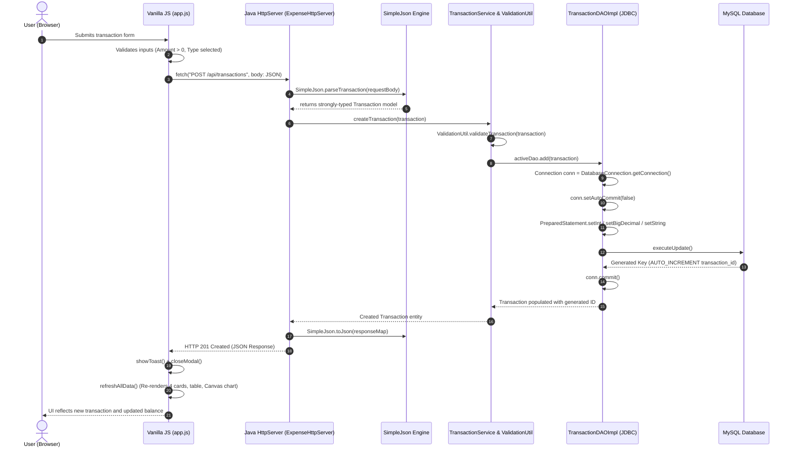
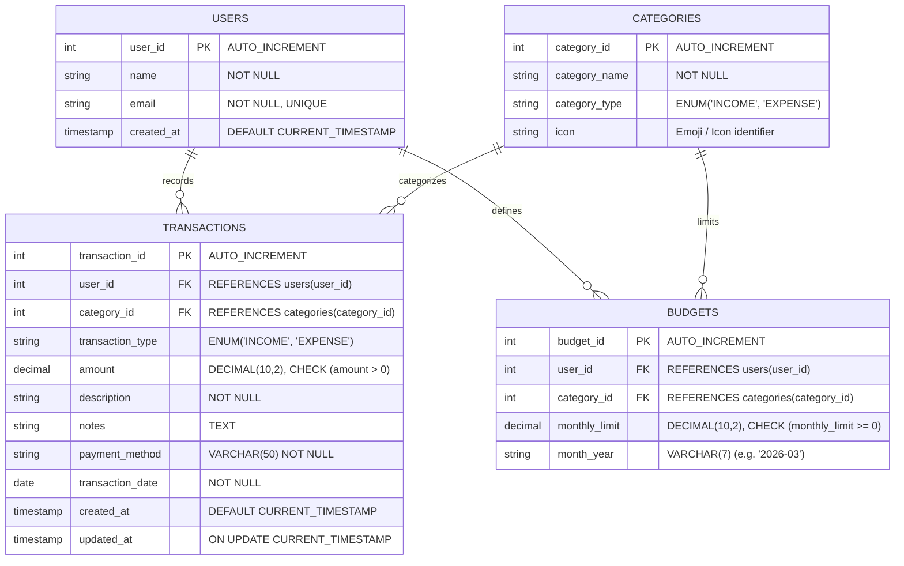

# 💰 Personal Income and Expense Tracker (Core Java + Web UI + JDBC)

A full-stack, production-grade **Personal Income and Expense Tracker** built from the ground up to demonstrate deep mastery of **Core Java**, **Object-Oriented Programming (OOP)**, the **Java Collections Framework**, **Exception Handling**, **JDBC & MySQL**, **Data Structures & Algorithms (DSA)**, **RESTful Web APIs**, and the **JavaScript Fetch API** — completely **free of heavy frameworks** such as Spring Boot, Hibernate/JPA, Node.js, Express, React, Bootstrap, or Tailwind CSS.

---

## 📋 Table of Contents
- [Project Overview](#-project-overview)
- [How I Explain This Project in an Interview (60–90s Pitch)](#-how-i-explain-this-project-in-an-interview-6090s-pitch)
- [Key Features](#-key-features)
- [Technology Stack & Architectural Constraints](#-technology-stack--architectural-constraints)
- [System Architecture](#-system-architecture)
  - [Layered Architecture Diagram](#layered-architecture-diagram)
  - [End-to-End Request-Response Lifecycle ("Add Transaction")](#-end-to-end-request-response-lifecycle-add-transaction)
- [Relational Database Design & Schema](#-relational-database-design--schema)
  - [Entity-Relationship (ER) Diagram](#entity-relationship-er-diagram)
  - [SQL Aggregation & Analytical Queries](#sql-aggregation--analytical-queries)
- [Project Directory Structure](#-project-directory-structure)
- [Core Java & Computer Science Concepts Demonstrated](#-core-java--computer-science-concepts-demonstrated)
  - [1. Object-Oriented Programming (OOP)](#1-object-oriented-programming-oop)
  - [2. Java Collections Framework](#2-java-collections-framework)
  - [3. Exception Handling Hierarchy](#3-exception-handling-hierarchy)
  - [4. JDBC Lifecycle & Transaction Management](#4-jdbc-lifecycle--transaction-management)
  - [5. Data Structures & Algorithms (DSA)](#5-data-structures--algorithms-dsa)
  - [6. Zero-Dependency JSON Engine](#6-zero-dependency-json-engine)
- [REST API Specification](#-rest-api-specification)
- [How to Build & Run](#-how-to-build--run)
  - [Prerequisites](#prerequisites)
  - [Running the Web Application (Default)](#running-the-web-application-default)
  - [Running the Interactive Terminal CLI](#running-the-interactive-terminal-cli)
  - [Running the Automated Test Suite](#running-the-automated-test-suite)
  - [Manual MySQL Database Setup](#manual-mysql-database-setup)
- [💡 20 Fresher Interview Questions & Answers](#-20-fresher-interview-questions--answers)
- [Current Limitations & Future Enhancements](#-current-limitations--future-enhancements)
- [License](#-license)

---

## 🎯 Project Overview

This project is engineered specifically for a fresher or junior Java developer seeking to prove rigorous understanding of software engineering fundamentals. Rather than abstracting critical mechanics behind framework magic (`@SpringBootApplication`, `@Autowired`, `@Entity`, `@RestController`), every layer is explicitly coded:

- **Unified Transaction Engine**: Treats both **Income** and **Expense** as first-class citizens using a unified entity model and strong typing (`TransactionType.INCOME` / `TransactionType.EXPENSE`).
- **HTTP Web Server**: Built on the Java SE standard library `com.sun.net.httpserver.HttpServer` with custom request dispatching, query-string parsing, static asset streaming, MIME-type resolution, and CORS management.
- **Relational Persistence**: Direct JDBC via `java.sql.DriverManager`, utilizing parameterized `PreparedStatement`s, relational `JOIN`s, SQL aggregation queries (`SUM`, `GROUP BY`, `ORDER BY`), and ACID transaction management (`commit`/`rollback`).
- **Configurable Storage Modes**: Defaults to `storage.mode=mysql` in `db.properties` with explicit, user-friendly error banners when MySQL is offline. Also provides an in-memory mode (`storage.mode=memory`) powered by Java Collections for instant zero-config testing.
- **Native Frontend**: Pure **Vanilla HTML5, CSS3, and JavaScript** with `fetch()`, DOM updates, and an HTML5 Canvas donut chart (zero Bootstrap, zero Tailwind, zero React, zero Chart.js).
- **Algorithmic Rigor**: Hand-crafted **MergeSort**, **QuickSort**, **Binary Search**, and multi-field linear filtering for in-depth data analysis.
- **Indian Rupee (`₹`) Localization**: All currency displays, calculations, formatted outputs, and sample records consistently use the Indian Rupee symbol (`₹`) formatted with standard Indian grouping.

---

## 🎙 How I Explain This Project in an Interview (60–90s Pitch)

> *"I built a full-stack **Personal Income and Expense Tracker** using pure Core Java, JDBC, MySQL, and Vanilla JavaScript without using Spring Boot, Hibernate, or frontend frameworks.*
> 
> *The goal was to deeply understand what frameworks do under the hood. For the backend, I used Java's built-in `HttpServer` to implement RESTful endpoints. I created a custom recursive-descent JSON parser and serializer to handle request/response payloads without third-party libraries.*
> 
> *For the data layer, I designed a normalized MySQL relational schema with four tables: `users`, `categories`, `transactions`, and `budgets`, linked by foreign keys and check constraints. I implemented the Data Access Object (DAO) pattern using plain JDBC with `PreparedStatement` to prevent SQL injection, and managed explicit transaction boundaries with `commit` and `rollback`.*
> 
> *To handle both income and expenses, I built a unified `Transaction` domain model governed by a `TransactionType` enum. The service layer computes real-time financial KPIs like Net Balance (`Total Income - Total Expenses`), Category Budgets, and Monthly Savings. On the algorithmic side, I implemented hand-crafted MergeSort and QuickSort to sort transactions by amount or date, alongside Binary Search for date queries.*
> 
> *The frontend is built entirely in Vanilla HTML, CSS, and JavaScript using the Fetch API and HTML5 Canvas for dynamic donut charts. Building this without frameworks gave me a complete, hands-on understanding of the entire HTTP request lifecycle, database connection management, and core OOP principles."*

---

## ✨ Key Features

1. **Four Primary KPI Dashboard Cards**:
   - **Current Balance**: Calculated as `Total Income - Total Expenses` (color-coded green for surplus, red for deficit).
   - **Total Income**: Aggregated sum of all income transactions for the period.
   - **Total Expenses**: Aggregated sum of all outgoing expenditure.
   - **Monthly Budget**: Current month's overall budget limit, spent amount, remaining budget, and percentage utilization.
2. **Monthly Summary & Insights**:
   - Month/Year selector, Total Income, Total Expenses, Net Savings (`Income - Expenses`), Transaction count, Highest Expense, and Top Spending Category.
3. **HTML5 Canvas Visualizations**:
   - Pure canvas donut chart illustrating category distributions with legend and percentage breakdowns (zero external charting library).
4. **Cascading Category Selection**:
   - Modal form dynamically loads categories filtered by transaction type (selecting "Income" shows Salary, Freelance, Investments; selecting "Expense" shows Food, Rent, Utilities, etc.).
5. **Budget Monitoring & Threshold Alerts**:
   - Tracks monthly category limits. Visual indicator turns orange at $70\%$ and red when exceeded ($>90\%$).
6. **Interactive DSA Sorting & Benchmarking**:
   - Toggle between standard **TimSort** (`Collections.sort`), custom **MergeSort** ($O(N \log N)$), and custom **QuickSort** ($O(N \log N)$) directly from the UI and inspect backend execution timings.
7. **Multi-Criteria Search & Filtering**:
   - Debounced search by description/notes, filter by transaction type (`ALL`, `INCOME`, `EXPENSE`), category, payment method, and date ranges.
8. **CSV Data Export**:
   - One-click export of transactions formatted in standard CSV format via the `/api/export` endpoint.
9. **Interactive Terminal CLI**:
   - Complete alternative console interface with formatted ASCII tables, `Scanner` input, and validation menus.
10. **Automated Test Suite**:
    - 35 self-contained unit and integration assertions covering model encapsulation, category type validation, balance math, sorting, searching, and JSON serialization.

---

## 🛡 Technology Stack & Architectural Constraints

| Component | Technology | Rationale |
|---|---|---|
| **Programming Language** | Java 17+ (Java 23 verified) | Standard Java SE features: Enums, Records, Time API, Collections, Streams |
| **HTTP Web Server** | `com.sun.net.httpserver.HttpServer` | Built directly into the JDK standard library (`jdk.httpserver`) |
| **Database Persistence** | JDBC (`java.sql.*`) + MySQL 8.x | Demonstrates relational SQL schema, `PreparedStatement`, and transaction management |
| **Connection Lifecycle** | Direct `DriverManager` lifecycle | Explicit connection creation and try-with-resources closure (no connection pool claimed) |
| **Fallback Persistence** | Java Collections (`LinkedHashMap`) | Thread-safe in-memory caching and zero-friction instant startup when configured |
| **Data Interchange** | Custom `SimpleJson` Parser & Serializer | Core Java recursive-descent tokenization (no Jackson or Gson needed) |
| **Frontend UI** | HTML5, CSS3, Vanilla JavaScript (Fetch API) | Native browser features (no React, Angular, Vue, Bootstrap, or Tailwind) |
| **Charting Engine** | Pure HTML5 Canvas 2D API | High-performance 2D drawing of donut charts, arcs, tooltips, and legends |
| **Build Tools** | Shell script (`run.sh`) / Batch (`run.bat`) | Clean compilation and execution via standard `javac` and `java` |

---

## 🏛 System Architecture

### Layered Architecture Diagram

```
┌────────────────────────────────────────────────────────────────────────┐
│                              Client Layer                              │
│  - Vanilla HTML5 / CSS3 Responsive Dashboard (Indian Rupee ₹)           │
│  - Vanilla JavaScript (Fetch API, async/await, DOM manipulation)       │
│  - Pure HTML5 Canvas Donut Chart Engine (Zero Chart.js / D3)           │
└───────────────────────────────────┬────────────────────────────────────┘
                                    │ HTTP REST Requests (JSON)
                                    ▼
┌────────────────────────────────────────────────────────────────────────┐
│                   Web & Controller Layer (Java SE)                     │
│  - com.sun.net.httpserver.HttpServer                                   │
│  - ExpenseHttpServer (Router, CORS, Query parser, Static File Handler) │
│  - SimpleJson (Custom recursive-descent parser & serializer)           │
└───────────────────────────────────┬────────────────────────────────────┘
                                    │
                                    ▼
┌────────────────────────────────────────────────────────────────────────┐
│                            Service Layer                               │
│  - TransactionService (Business logic, validation, balance compute)    │
│  - ValidationUtil (Positive amount, non-empty text, category matching) │
└───────────────────┬────────────────────────────────┬───────────────────┘
                    │                                │
                    ▼                                ▼
┌──────────────────────────────────────┐ ┌───────────────────────────────┐
│              DSA Layer               │ │       Data Access (DAO)       │
│ - TransactionSorter (Merge/Quick)    │ │ - TransactionDAO (Interface)  │
│ - TransactionSearcher (Binary/Linear)│ │ - TransactionDAOImpl (JDBC)   │
│ - Category & Monthly Aggregators     │ │ - InMemoryTransactionDAO (Map)│
└──────────────────────────────────────┘ └───────────────┬───────────────┘
                                                         │
                                                         ▼
                                         ┌───────────────────────────────┐
                                         │       Persistence Layer       │
                                         │ - MySQL 8.x Database via JDBC │
                                         │ - In-Memory LinkedHashMap     │
                                         └───────────────────────────────┘
```

---

### 🔄 End-to-End Request-Response Lifecycle ("Add Transaction")

When a user submits an income or expense transaction, the request flows through every layer of the architecture:

```
User clicks "Save Transaction"
        ↓
JavaScript reads form & validates inputs
        ↓
fetch() sends POST /api/transactions with JSON payload
        ↓
Java HttpServer receives request & routes to TransactionsHandler
        ↓
SimpleJson parses JSON into a Transaction domain model
        ↓
TransactionService validates business rules (type match, positive amount)
        ↓
TransactionDAO abstraction selects active persistence provider
        ↓
TransactionDAOImpl binds PreparedStatement parameters
        ↓
JDBC executes SQL INSERT inside transaction boundary (commit/rollback)
        ↓
MySQL persists record and returns auto-generated primary key
        ↓
Handler generates JSON response via SimpleJson.toJson()
        ↓
JavaScript updates UI (cards, table, Canvas donut chart, alert toast)
```

#### Sequence Flow Diagram



---

## 🗄 Relational Database Design & Schema

The relational schema is defined in [schema.sql](schema.sql) and enforces referential integrity through foreign keys, check constraints, and performance indexes.

### Entity-Relationship (ER) Diagram



### SQL Aggregation & Analytical Queries

The application executes optimized SQL queries in [TransactionDAOImpl.java](src/com/expensetracker/dao/TransactionDAOImpl.java):

```sql
-- 1. Dashboard Financial Summary (Net Balance, Income, Expense)
SELECT 
    COALESCE(SUM(CASE WHEN transaction_type = 'INCOME' THEN amount ELSE 0 END), 0) AS total_income,
    COALESCE(SUM(CASE WHEN transaction_type = 'EXPENSE' THEN amount ELSE 0 END), 0) AS total_expense,
    COALESCE(SUM(CASE WHEN transaction_type = 'INCOME' THEN amount ELSE -amount END), 0) AS balance
FROM transactions
WHERE user_id = ?;

-- 2. Category-Wise Expense Distribution
SELECT 
    c.category_id,
    c.category_name,
    c.icon,
    COUNT(t.transaction_id) AS transaction_count,
    COALESCE(SUM(t.amount), 0.00) AS total_spent
FROM categories c
JOIN transactions t ON c.category_id = t.category_id
WHERE t.user_id = ? AND t.transaction_type = 'EXPENSE'
GROUP BY c.category_id, c.category_name, c.icon
ORDER BY total_spent DESC;

-- 3. Top 5 Largest Expenses
SELECT 
    t.transaction_id, t.description, t.amount, t.transaction_date,
    c.category_name, c.icon, t.payment_method
FROM transactions t
JOIN categories c ON t.category_id = c.category_id
WHERE t.user_id = ? AND t.transaction_type = 'EXPENSE'
ORDER BY t.amount DESC
LIMIT 5;

-- 4. Monthly Budget Utilization
SELECT 
    b.budget_id,
    c.category_name,
    b.monthly_limit,
    COALESCE(SUM(t.amount), 0.00) AS actual_spent,
    (b.monthly_limit - COALESCE(SUM(t.amount), 0.00)) AS remaining,
    ROUND((COALESCE(SUM(t.amount), 0.00) / b.monthly_limit) * 100, 1) AS percent_used
FROM budgets b
JOIN categories c ON b.category_id = c.category_id
LEFT JOIN transactions t 
    ON b.category_id = t.category_id 
    AND b.user_id = t.user_id 
    AND t.transaction_type = 'EXPENSE'
    AND DATE_FORMAT(t.transaction_date, '%Y-%m') = b.month_year
WHERE b.user_id = ? AND b.month_year = DATE_FORMAT(CURDATE(), '%Y-%m')
GROUP BY b.budget_id, c.category_name, b.monthly_limit, b.month_year;
```

---

## 📂 Project Directory Structure

```
ExpenseTracker/
├── src/
│   └── com/
│       └── expensetracker/
│           ├── model/
│           │   ├── TransactionType.java       # Enum: INCOME, EXPENSE
│           │   ├── Transaction.java           # Unified model (Encapsulation, Comparable)
│           │   ├── Category.java              # Entity: categoryId, name, type, icon
│           │   ├── PaymentMethod.java         # Enum: Cash, UPI, Credit Card, Net Banking
│           │   ├── User.java                  # Entity: userId, name, email
│           │   ├── Budget.java                # Entity: budgetId, monthlyLimit, spent, % used
│           │   ├── DashboardSummary.java      # DTO: Balance, Income, Expenses, Monthly Budget
│           │   ├── MonthlySummary.java        # DTO: Income, Expenses, Savings, Top Category
│           │   └── CategorySummary.java       # DTO: Category aggregations for charts
│           ├── exception/
│           │   ├── ExpenseTrackerException.java     # Base domain exception (checked)
│           │   ├── TransactionNotFoundException.java# Thrown on 404 lookups
│           │   ├── InvalidTransactionException.java # Thrown on domain rule violations (400)
│           │   ├── InvalidAmountException.java      # Thrown when amount <= 0
│           │   └── DatabaseOperationException.java # Wraps low-level SQLExceptions (500)
│           ├── util/
│           │   ├── DatabaseConfig.java        # Loads db.properties (storage.mode, URL, user)
│           │   ├── DatabaseConnection.java    # JDBC DriverManager connection manager
│           │   ├── DateTimeUtil.java          # Date formatting & parsing (java.time)
│           │   ├── ValidationUtil.java        # Business constraint validation
│           │   └── SimpleJson.java            # Zero-dependency Core Java JSON parser/serializer
│           ├── dsa/
│           │   ├── TransactionSorter.java     # MergeSort, QuickSort, TimSort & Comparators
│           │   └── TransactionSearcher.java   # Binary Search by date & Linear search
│           ├── dao/
│           │   ├── TransactionDAO.java        # DAO Interface contract
│           │   ├── TransactionDAOImpl.java    # JDBC implementation (MySQL PreparedStatements)
│           │   └── InMemoryTransactionDAO.java# Collections-backed in-memory implementation
│           ├── service/
│           │   └── TransactionService.java    # Business logic, validations & report orchestration
│           ├── web/
│           │   └── ExpenseHttpServer.java     # Java SE HTTP Server, REST router & static handler
│           ├── test/
│           │   └── ExpenseTrackerTest.java    # Automated unit and integration test suite (35 tests)
│           └── Main.java                      # Dual entry point: Web Server or CLI Console
├── web/
│   ├── index.html                             # Semantic HTML5 Single Page Application UI
│   ├── style.css                              # Custom responsive CSS design system (₹ styling)
│   └── app.js                                 # Vanilla JS Fetch API client & Canvas donut chart
├── db.properties                              # Active configuration file (storage.mode=mysql)
├── db.example.properties                      # Configuration template for deployment
├── schema.sql                                 # Relational schema DDL, indexes, and seed data
├── run.sh                                     # macOS / Linux build and execution script
├── run.bat                                    # Windows build and execution script
├── .gitignore                                 # Git ignore configuration
└── README.md                                  # Complete project documentation
```

---

## 🧠 Core Java & Computer Science Concepts Demonstrated

### 1. Object-Oriented Programming (OOP)
- **Encapsulation**: Private fields across all models ([Transaction.java](src/com/expensetracker/model/Transaction.java), [Category.java](src/com/expensetracker/model/Category.java), [Budget.java](src/com/expensetracker/model/Budget.java)) with defensive getters and setters. Mutators validate invariants (e.g. throwing `InvalidAmountException` when `amount <= 0`).
- **Abstraction**: The [TransactionDAO.java](src/com/expensetracker/dao/TransactionDAO.java) interface provides an abstract data access contract. The service layer interacts solely with the interface, decoupled from whether the backing store is MySQL or in-memory collections.
- **Polymorphism**: Runtime polymorphism allows switching between [TransactionDAOImpl.java](src/com/expensetracker/dao/TransactionDAOImpl.java) (JDBC) and [InMemoryTransactionDAO.java](src/com/expensetracker/dao/InMemoryTransactionDAO.java) transparently without changing a single line in [TransactionService.java](src/com/expensetracker/service/TransactionService.java).
- **Inheritance & Enums**: Strong typing via [TransactionType.java](src/com/expensetracker/model/TransactionType.java) and [PaymentMethod.java](src/com/expensetracker/model/PaymentMethod.java) ensures compile-time safety and self-documenting code.

### 2. Java Collections Framework
- **`LinkedHashMap<Integer, Transaction>`**: Used in `InMemoryTransactionDAO` to achieve $O(1)$ constant-time lookup by primary key while preserving chronological insertion order.
- **`ArrayList<Transaction>`**: Used for dynamic list handling, sublist partitioning in sorting algorithms, and table rendering.
- **`TreeMap<String, Double>`**: Used for sorting monthly aggregates in ascending chronological order (`YYYY-MM`).
- **`Comparator<Transaction>`**: Multiple custom comparators (`BY_DATE_DESC`, `BY_AMOUNT_DESC`, `BY_DESCRIPTION_ASC`) supporting multi-attribute sorting.
- **Streams & Lambdas**: Used alongside classic loops for functional filtering, map-reduce aggregations, and list conversions.

### 3. Exception Handling Hierarchy
```
java.lang.Exception
 └── ExpenseTrackerException (Base Domain Exception)
      ├── TransactionNotFoundException (HTTP 404)
      ├── InvalidTransactionException (HTTP 400 - category type mismatch, missing fields)
      ├── InvalidAmountException (HTTP 400 - amount <= 0)
      └── DatabaseOperationException (HTTP 500 - wraps java.sql.SQLException)
```
- **Try-With-Resources**: Guaranteed closure of `Connection`, `PreparedStatement`, `ResultSet`, and `InputStream` resources without memory leaks.
- **Exception Wrapping**: Checked low-level SQLExceptions are caught in the DAO layer and wrapped in domain `DatabaseOperationException`s, keeping the Service layer database-agnostic.

### 4. JDBC Lifecycle & Transaction Management
- **SQL Injection Defense**: 100% of SQL statements utilize parameterized `PreparedStatement`s with explicit placeholder binding (`ps.setBigDecimal(...)`, `ps.setString(...)`).
- **Connection Lifecycle via `DriverManager`**: Connections are opened per operation using standard `DriverManager.getConnection()` and closed immediately via try-with-resources. No connection pool is used or claimed.
- **ACID Transactions**: Write operations use explicit transaction boundaries:
  ```java
  Connection conn = DatabaseConnection.getConnection();
  try {
      conn.setAutoCommit(false); // Begin ACID Transaction
      // Execute SQL operations...
      conn.commit();             // Commit Transaction
  } catch (SQLException e) {
      if (conn != null) conn.rollback(); // Rollback on error
      throw new DatabaseOperationException("Failed transaction: " + e.getMessage(), e);
  } finally {
      DatabaseConnection.closeQuietly(conn);
  }
  ```

### 5. Data Structures & Algorithms (DSA)
- **MergeSort ($O(N \log N)$ Time, Stable Sort)**:
  - Custom divide-and-conquer implementation in [TransactionSorter.java](src/com/expensetracker/dsa/TransactionSorter.java).
  - Recursively splits the list into left and right halves and merges them back in sorted order using two pointers and any provided `Comparator`.
- **QuickSort ($O(N \log N)$ Average Time, In-Place)**:
  - Custom implementation using Lomuto partitioning with a middle-element pivot to prevent worst-case $O(N^2)$ on pre-sorted input.
- **Binary Search ($O(\log N)$ Time)**:
  - Implemented in [TransactionSearcher.java](src/com/expensetracker/dsa/TransactionSearcher.java) to find transactions on a target date from a date-sorted list in $O(\log N + K)$ time, where $K$ is the number of transactions on that date.
- **Linear Search & Multi-Field Filtering ($O(N)$ Time)**:
  - Scans description, category, payment method, date, and notes for keyword and boundary matches.

### 6. Zero-Dependency JSON Engine
- [SimpleJson.java](src/com/expensetracker/util/SimpleJson.java) contains a hand-crafted recursive-descent parser and serializer written in pure Core Java.
- Handles curly braces `{...}`, square brackets `[...]`, escaped unicode characters, quoted strings, numbers, booleans, and nulls.
- Directly serializes and deserializes `Transaction`, `Budget`, `DashboardSummary`, `MonthlySummary`, and `CategorySummary` objects without Jackson, Gson, or any external library.

---

## 🌐 REST API Specification

All REST endpoints communicate using JSON payloads and standard HTTP status codes:

| Method | Endpoint | Description | Status Codes |
|---|---|---|---|
| `GET` | `/api/dashboard` | Returns 4 primary cards: Balance, Total Income, Total Expenses, Monthly Budget, and recent transactions | `200 OK` |
| `GET` | `/api/transactions` | Lists transactions. Query params: `type`, `search`, `category`, `paymentMethod`, `startDate`, `endDate`, `sortBy`, `sortOrder`, `algo` | `200 OK` |
| `GET` | `/api/transactions/{id}` | Retrieves a specific transaction by ID | `200 OK`, `404 Not Found` |
| `POST` | `/api/transactions` | Creates a new transaction. Validates amount $> 0$ and category type match | `201 Created`, `400 Bad Request` |
| `PUT` | `/api/transactions/{id}` | Updates an existing transaction record | `200 OK`, `400 Bad Request`, `404 Not Found` |
| `DELETE`| `/api/transactions/{id}` | Permanently deletes a transaction | `200 OK`, `404 Not Found` |
| `GET` | `/api/categories` | Lists all categories. Supports optional `?type=INCOME` or `?type=EXPENSE` query param | `200 OK` |
| `GET` | `/api/reports/monthly` | Returns monthly financial report: Income, Expenses, Savings, Top Category, Highest Expense | `200 OK` |
| `GET` | `/api/reports/categories` | Returns category-wise expense distribution for HTML5 Canvas donut chart | `200 OK` |
| `GET` | `/api/reports/top-expenses` | Returns top 5 highest expenses for quick spending insight | `200 OK` |
| `GET` | `/api/budget` | Returns monthly expense budget with current spend & utilization percentage | `200 OK` |
| `POST` | `/api/budget` | Sets or updates a monthly category budget limit | `200 OK`, `400 Bad Request` |
| `GET` | `/api/export` | Downloads all transactions formatted as a CSV file attachment | `200 OK` (`text/csv`) |
| `GET` | `/api/status` | Health check endpoint reporting active storage mode and JVM statistics | `200 OK` |

### Sample JSON Payloads

#### Create Transaction (`POST /api/transactions`):
```json
{
  "userId": 1,
  "categoryId": 1,
  "transactionType": "EXPENSE",
  "amount": 450.00,
  "description": "Weekly Grocery Restock",
  "paymentMethod": "UPI",
  "transactionDate": "2026-03-24",
  "notes": "Vegetables, milk, and household essentials"
}
```

#### Success Response (`201 Created`):
```json
{
  "success": true,
  "message": "Transaction created successfully",
  "data": {
    "transactionId": 101,
    "userId": 1,
    "categoryId": 1,
    "categoryName": "Food & Dining",
    "categoryIcon": "🍔",
    "transactionType": "EXPENSE",
    "amount": 450.00,
    "description": "Weekly Grocery Restock",
    "paymentMethod": "UPI",
    "transactionDate": "2026-03-24",
    "notes": "Vegetables, milk, and household essentials",
    "createdAt": "2026-03-24 22:30:00"
  }
}
```

#### Dashboard Summary Response (`GET /api/dashboard`):
```json
{
  "totalIncome": 65000.00,
  "totalExpenses": 22500.00,
  "currentBalance": 42500.00,
  "monthlyBudget": 30000.00,
  "budgetSpent": 22500.00,
  "budgetRemaining": 7500.00,
  "budgetUsedPercentage": 75.0,
  "recentTransactions": [...]
}
```

---

## 🚀 How to Build & Run

### Prerequisites
- **JDK 17 or higher** (Java 23 verified). Verify with:
  ```bash
  java -version
  javac -version
  ```
- No Maven, Gradle, Node.js, or external package managers required.

---

### Running the Web Application (Default)

On macOS / Linux:
```bash
./run.sh
```
On Windows:
```cmd
run.bat
```

1. Open your browser and navigate to: **`http://localhost:8080/`**
2. If port 8080 is occupied by another process, the server automatically fails over to port 8081, 8082, etc., and logs the active URL.
3. You can also specify an explicit port:
   ```bash
   ./run.sh web 9000
   ```

---

### Running the Interactive Terminal CLI
```bash
./run.sh console
```
Launches an interactive menu directly in your terminal to record income/expenses, view ASCII financial tables, filter records, and inspect budgets using standard console input (`Scanner`).

---

### Running the Automated Test Suite
```bash
./run.sh test
```
Executes all 35 unit and integration assertions covering model encapsulation, category type match validations, balance calculations, MergeSort, QuickSort, Binary Search, and JSON serialization.

---

### Manual MySQL Database Setup

By default, `db.properties` is configured with `storage.mode=mysql`. Follow these steps to connect your local MySQL server:

1. **Start MySQL Server**:
   Ensure your local MySQL service is running.
2. **Execute Schema & Seed Script**:
   Run the SQL script using your MySQL client:
   ```bash
   mysql -u root -p < schema.sql
   ```
   This creates the database `expense_tracker_db`, tables (`users`, `categories`, `transactions`, `budgets`), check constraints, performance indexes, and initial seed data.
3. **Configure Database Credentials**:
   Edit `db.properties` (or copy from `db.example.properties`):
   ```properties
   storage.mode=mysql
   db.url=jdbc:mysql://localhost:3306/expense_tracker_db?useSSL=false&allowPublicKeyRetrieval=true&serverTimezone=UTC
   db.user=root
   db.password=your_mysql_password
   ```
4. **Ensure MySQL JDBC Driver is Present**:
   The project includes the MySQL Connector JAR in the `lib/` directory (`lib/mysql-connector-j-8.3.0.jar`).
5. **Start the Application**:
   ```bash
   ./run.sh
   ```
   On startup, you will see:
   ```
   [DatabaseConnection] Testing connection to jdbc:mysql://localhost:3306/expense_tracker_db...
   [DatabaseConnection] Connection successful!
   ```

> [!NOTE]
> If MySQL is offline while `storage.mode=mysql`, the application starts up and displays an informative error banner with a **[Try Again]** button on the UI instead of crashing silently.
> If you want to run completely offline without MySQL, change `storage.mode=memory` in `db.properties`.

---

## 💡 20 Fresher Interview Questions & Answers

### Q1: Why did you build this project using Core Java and built-in HttpServer rather than Spring Boot?
> **Answer**: Building the project without Spring Boot demonstrates a deep grasp of foundational concepts. Rather than relying on annotations like `@RestController` or `@Service`, I explicitly implemented HTTP routing, query-string parsing, static asset streaming, CORS handling, and JSON serialization. Once you master how the underlying HTTP request-response cycle and JDBC lifecycles work, learning framework abstractions like Spring's `DispatcherServlet` or Spring Data becomes straightforward and intuitive.

### Q2: Walk me through the architecture and design of this project.
> **Answer**: The application follows a classic Layered Architecture with strict Separation of Concerns:
> 1. **Client Layer**: Pure Vanilla HTML5, CSS3, and JavaScript utilizing `fetch()` and HTML5 Canvas.
> 2. **Web Layer**: `com.sun.net.httpserver.HttpServer` routing endpoints to handler methods.
> 3. **Service Layer**: `TransactionService` enforcing business rules, category validations, and computing KPI aggregations.
> 4. **Data Access (DAO) Layer**: Decoupled via the `TransactionDAO` interface, implemented by `TransactionDAOImpl` for JDBC/MySQL and `InMemoryTransactionDAO` for testing.
> 5. **DSA Layer**: Hand-crafted sorting and searching algorithms for offline processing and benchmarking.

### Q3: How did you implement OOP principles in this application?
> **Answer**:
> - **Encapsulation**: Models like `Transaction` and `Budget` have private fields with validation in constructors and mutators (e.g. rejecting negative amounts).
> - **Abstraction**: The `TransactionDAO` interface hides database implementation details from `TransactionService`.
> - **Inheritance & Enums**: `TransactionType` (`INCOME`, `EXPENSE`) and `PaymentMethod` enforce strongly-typed domain constants.
> - **Polymorphism**: The service layer calls `TransactionDAO` methods without knowing whether the runtime instance is `TransactionDAOImpl` or `InMemoryTransactionDAO`.

### Q4: Why did you choose a unified Transaction model instead of separate Income and Expense classes or tables?
> **Answer**: Both income and expense share identical fundamental properties: an ID, user ID, category, amount, description, notes, payment method, and transaction date. Storing them in a single `transactions` table with a `transaction_type` enum (`INCOME` / `EXPENSE`) makes computing Net Balance (`SUM(CASE WHEN type = 'INCOME' THEN amount ELSE -amount END)`) a single fast SQL query. It also simplifies the codebase, avoids redundant tables, and mirrors real-world accounting ledgers.

### Q5: What is the difference between Statement and PreparedStatement in JDBC, and how did you prevent SQL injection?
> **Answer**: A `Statement` compiles the SQL query on every execution and concatenates raw input strings, leaving it vulnerable to SQL Injection. A `PreparedStatement` pre-compiles the SQL query template and transmits parameters separately via placeholders (`?`). The database engine treats parameter values strictly as literal data, never as executable SQL code. In this project, 100% of SQL interactions use `PreparedStatement`.

### Q6: How does connection management work in your application? Do you use connection pooling?
> **Answer**: I manage JDBC connections using standard `DriverManager.getConnection()`. I do **not** use a connection pool (like HikariCP or DBCP) to keep the project zero-dependency. Each DAO operation acquires a connection and safely closes it via try-with-resources. This demonstrates proper resource management and leak prevention at the core Java level.

### Q7: How did you implement ACID transactions in JDBC?
> **Answer**: In JDBC, auto-commit is enabled by default. For write operations, I explicitly invoke `conn.setAutoCommit(false)` to start a transaction boundary. After successfully executing the SQL statements, I call `conn.commit()`. If an exception occurs, `conn.rollback()` is executed in the `catch` block to guarantee atomicity and data consistency, followed by closing the connection in the `finally` block.

### Q8: What collections did you use and why?
> **Answer**:
> - **`LinkedHashMap<Integer, Transaction>`**: Used in `InMemoryTransactionDAO` for $O(1)$ constant-time lookup by ID while preserving chronological insertion order.
> - **`ArrayList<Transaction>`**: Used for dynamic list manipulation, sublist slicing in divide-and-conquer algorithms, and JSON serialization.
> - **`TreeMap<String, Double>`**: Used for chronological monthly aggregation (`YYYY-MM`) with automatic key ordering.
> - **`Comparator<Transaction>`**: Multiple custom comparators (`BY_DATE_DESC`, `BY_AMOUNT_DESC`, `BY_DESCRIPTION_ASC`) for multi-attribute sorting.

### Q9: How does the exception handling hierarchy work in your project?
> **Answer**: I defined a root checked domain exception, `ExpenseTrackerException`, with specific subclasses:
> - `TransactionNotFoundException` (mapped to HTTP 404).
> - `InvalidTransactionException` and `InvalidAmountException` (mapped to HTTP 400 with descriptive error messages).
> - `DatabaseOperationException` (mapped to HTTP 500, wrapping low-level `SQLException`s).
> This prevents database-specific exceptions from leaking into the web layer and provides consistent, structured JSON error responses to the client.

### Q10: How did you implement MergeSort and QuickSort from scratch, and what are their complexities?
> **Answer**:
> - **MergeSort**: Implemented in `TransactionSorter.java` using a divide-and-conquer approach. The list is recursively bisected until sublists have size 1, then merged back in sorted order using two pointers and a `Comparator`. It provides guaranteed $O(N \log N)$ time in worst, average, and best cases, and is a **stable** sort. Space complexity is $O(N)$.
> - **QuickSort**: Implemented using Lomuto partitioning with a middle-element pivot to prevent $O(N^2)$ degeneration on already-sorted input. It operates in $O(N \log N)$ average time and $O(\log N)$ auxiliary stack space.

### Q11: How does Binary Search work in your project, and what are its preconditions?
> **Answer**: Binary Search requires the input collection to be sorted beforehand. In `TransactionSearcher.java`, `binarySearchByDate` expects a list sorted by date ascending. It checks the middle element and halves the search space each step in $O(\log N)$ time. Once an initial match is located, it scans left and right to gather all transactions occurring on that same date in $O(K)$ time where $K$ is the number of matching records.

### Q12: How does your custom JSON engine (SimpleJson) work without third-party libraries?
> **Answer**: `SimpleJson.java` implements a custom recursive-descent parser. It iterates through the JSON payload character by character, tracking structural tokens (`{`, `}`, `[`, `]`, `:`, `,`), unescaping strings, parsing numbers, booleans, and nulls. It builds an intermediate object tree (`Map<String, Object>` and `List<Object>`), which is then mapped into strongly-typed Java entities like `Transaction` and `Budget`.

### Q13: How does Java's built-in HttpServer handle concurrent HTTP requests?
> **Answer**: By default, `HttpServer` can process requests sequentially on a dispatcher thread or concurrently using an executor. In `ExpenseHttpServer`, I configured a thread pool executor (`Executors.newFixedThreadPool(10)`). This allows up to 10 concurrent HTTP requests to be handled simultaneously on separate worker threads without blocking the main server thread.

### Q14: Explain the database schema and relational integrity.
> **Answer**: The schema consists of four relational tables:
> - `users`: Master table storing user credentials.
> - `categories`: Stores income and expense categories, with a check/enum constraint on `category_type`.
> - `transactions`: Links to `users` via `user_id` and `categories` via `category_id` (foreign keys with `ON DELETE CASCADE` or `RESTRICT`), with `CHECK (amount > 0)`.
> - `budgets`: Stores monthly limits per category and user, with a unique constraint on `(user_id, category_id, month_year)`.
> Indexes on `(user_id, transaction_date)` and `(category_id)` ensure high-speed querying.

### Q15: How does the application calculate the Current Balance and Monthly Savings?
> **Answer**:
> - **Current Balance**: $\text{Total Income} - \text{Total Expenses}$. In SQL, this is computed via:
>   `SUM(CASE WHEN transaction_type = 'INCOME' THEN amount ELSE -amount END)`.
> - **Monthly Savings**: Calculated for the active month as $\text{Monthly Income} - \text{Monthly Expenses}$. If positive, it reflects net savings; if negative, it flags a monthly deficit.

### Q16: How do you prevent invalid transactions (such as selecting an 'Expense' category for an 'Income' transaction)?
> **Answer**: Validation occurs at two independent levels:
> 1. **Frontend**: When the user toggles the "Income" or "Expense" tab in the modal, JavaScript dynamically filters the category dropdown to show only categories matching that type.
> 2. **Backend**: `ValidationUtil.validateTransaction()` verifies that `transaction.getCategoryId()` exists and its `categoryType` strictly matches `transaction.getTransactionType()`. If mismatched, an `InvalidTransactionException` is thrown, preventing bad data insertion.

### Q17: How did you implement cascading categories in the frontend UI?
> **Answer**: When the modal opens or the transaction type changes, `app.js` queries `categoriesCache` (loaded from `/api/categories`). It filters the list:
> ```javascript
> const filtered = categoriesCache.filter(c => c.categoryType === selectedType);
> ```
> It then dynamically rebuilds the `<option>` elements of the category `<select>` element, ensuring the user can only select valid categories for the active transaction type.

### Q18: What is the purpose of `storage.mode` in `db.properties` and how does the application handle database failures?
> **Answer**: `storage.mode` controls the persistence provider:
> - `storage.mode=mysql` (default): Attempts to connect to MySQL via JDBC. If MySQL is unreachable, it logs a clear diagnostic message and displays an error banner with a **[Try Again]** button on the UI, rather than silently falling back.
> - `storage.mode=memory`: Explicitly runs in Collections mode using `InMemoryTransactionDAO`, pre-seeded with sample data for offline testing or demo environments without a MySQL instance.

### Q19: Why did you use raw HTML5 Canvas for the donut chart instead of Chart.js or D3.js?
> **Answer**: Using raw HTML5 Canvas demonstrates a strong understanding of client-side graphics rendering and trigonometry. In `app.js`, `drawDonutChart()` calculates arc angles:
> $$\text{angle} = \left(\frac{\text{categoryAmount}}{\text{totalExpense}}\right) \times 2\pi$$
> It uses `ctx.arc()` to draw segmented donuts, clears the canvas on each render, and renders a center cut-out and text summary—achieving a lightweight, zero-dependency visualization.

### Q20: What are the trade-offs of this approach compared to an enterprise framework like Spring Boot?
> **Answer**:
> - **Advantages of this approach**: Zero bloat, instant startup ($< 500\text{ ms}$), minuscule memory footprint ($\approx 30\text{ MB}$ JVM heap), complete transparency over every line of code, and zero dependency vulnerabilities.
> - **Trade-offs**: Requires manual implementation of boilerplate code like connection lifecycle, JSON parsing, routing, and CORS headers. In large-scale enterprise systems, Spring Boot offers battle-tested features like declarative transactions (`@Transactional`), connection pooling, OAuth2 security, and mature ecosystem integrations.

---

## ⚠️ Current Limitations & Future Enhancements

1. **Authentication & Multi-Tenancy**: The application currently assumes a single active user (`userId = 1`). A future enhancement would be session token or JWT-based authentication.
2. **Connection Pooling**: Uses direct `DriverManager` connections. While ideal for learning and low-traffic apps, adding a lightweight connection pool (e.g. HikariCP) would optimize high-concurrency production deployments.
3. **Recurring Transactions**: Auto-generation of monthly recurring bills (rent, subscriptions) via a scheduled background executor.
4. **Pagination**: Transaction queries currently fetch all records matching filter parameters. Adding SQL `LIMIT` and `OFFSET` pagination would optimize handling datasets with tens of thousands of records.

---

## 📜 License

This project is open-source and released under the **MIT License**. Created as a comprehensive portfolio project for Core Java, JDBC, and Full-Stack Fresher Developer technical interviews.
