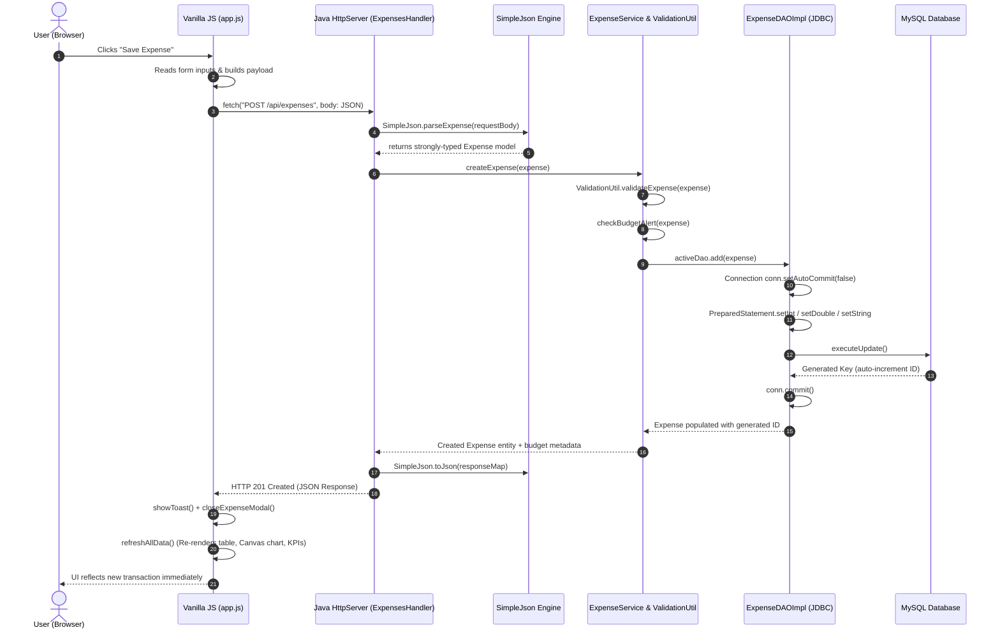

# 💰 Personal Expense Tracker (Core Java + Web UI + JDBC)

A full-stack Personal Expense Tracker built from the ground up to demonstrate mastery of **Core Java**, **Object-Oriented Programming (OOP)**, **Java Collections Framework**, **Exception Handling**, **JDBC & MySQL**, **Data Structures & Algorithms (DSA)**, **RESTful Web APIs**, and the **JavaScript Fetch API** — completely **free of heavy frameworks** like Spring Boot, Hibernate, Node.js, React, or Bootstrap.

---

## 📋 Table of Contents
- [Project Overview](#-project-overview)
- [Key Features](#-key-features)
- [Technology Stack & Architectural Constraints](#-technology-stack--architectural-constraints)
- [System Architecture](#-system-architecture)
- [Project Directory Structure](#-project-directory-structure)
- [Core Java & Computer Science Concepts Demonstrated](#-core-java--computer-science-concepts-demonstrated)
  - [1. Object-Oriented Programming (OOP)](#1-object-oriented-programming-oop)
  - [2. Java Collections Framework](#2-java-collections-framework)
  - [3. Exception Handling Hierarchy](#3-exception-handling-hierarchy)
  - [4. JDBC & Transaction Management](#4-jdbc--transaction-management)
  - [5. Data Structures & Algorithms (DSA)](#5-data-structures--algorithms-dsa)
  - [6. Zero-Dependency JSON Engine](#6-zero-dependency-json-engine)
- [REST API Specification](#-rest-api-specification)
- [Database Schema & Analytics Queries](#-database-schema--analytics-queries)
- [How to Build & Run](#-how-to-build--run)
  - [Prerequisites](#prerequisites)
  - [Running the Web Application (Default)](#running-the-web-application-default)
  - [Running the Interactive Terminal CLI](#running-the-interactive-terminal-cli)
  - [Running the Automated Test Suite](#running-the-automated-test-suite)
  - [MySQL Database Setup (Optional)](#mysql-database-setup-optional)
- [Fresher Interview Questions & Answers](#-fresher-interview-questions--answers)

---

## 🎯 Project Overview

This project is tailored specifically for a fresher or junior Java developer seeking to prove deep understanding of fundamentals. Rather than relying on Spring annotations (`@Autowired`, `@RestController`, `@Entity`), every layer is explicitly coded:
- **HTTP Server**: Built-in Java SE `com.sun.net.httpserver.HttpServer` (zero external web container).
- **Persistence**: Plain JDBC with MySQL, parameterized `PreparedStatement`, and explicit transaction management (`commit`/`rollback`).
- **Dual-Mode Persistence**: Automatically detects MySQL. If MySQL is offline, it seamlessly falls back to an **In-Memory Java Collections** engine so the application runs immediately without setup hurdles.
- **Frontend**: Pure **Vanilla HTML5, CSS3, and JavaScript** with `fetch()` and HTML5 Canvas (no Bootstrap, no Tailwind, no React, no Chart.js).
- **Algorithms**: Hand-crafted **MergeSort**, **QuickSort**, **Binary Search**, and multi-field linear filtering.

---

## ✨ Key Features

1. **Dashboard KPI Metrics**: Live computation of Total Spending, Average Transaction Amount, Top Category ($ and %), and Highest Expense.
2. **HTML5 Canvas Visualizations**: Pure canvas donut chart illustrating category distributions with legend and percentage breakdowns (zero charting library).
3. **Monthly Budget Tracking**: Category budget configuration with live color-coded progress bars (Green $\le 70\%$, Orange $70-90\%$, Red $>90\%$ or Exceeded).
4. **Real-Time Budget Warning**: Backend detects when an added expense causes a monthly category budget to exceed its limit and sends a warning toast alert.
5. **Interactive DSA Sorting & Benchmarking**: Toggle between **TimSort** (`Collections.sort`), **MergeSort** ($O(N \log N)$), and **QuickSort** ($O(N \log N)$) right from the UI and view backend execution times.
6. **Multi-Criteria Search & Filtering**: Debounced search by title/notes/payee, filter by category, payment method, date range, and amount boundaries.
7. **CSV Export**: Direct one-click export of expense transactions to CSV format via HTTP endpoint.
8. **Interactive Terminal CLI**: Complete alternative console interface with formatted ASCII tables, `Scanner` menus, and validation.
9. **Automated Test Suite**: 37 self-contained unit and integration assertions testing models, algorithms, validations, and JSON parsing.

---

## 🛡 Technology Stack & Architectural Constraints

| Component | Technology | Rationale |
|---|---|---|
| **Programming Language** | Java 17+ (Java 23 verified) | Standard Java SE features: Records, Enums, Time API, Collections, Streams |
| **HTTP Web Server** | `com.sun.net.httpserver.HttpServer` | Built directly into the JDK standard library (`jdk.httpserver`) |
| **Database Persistence** | JDBC (`java.sql.*`) + MySQL | Demonstrates SQL fundamentals, `PreparedStatement`, and transaction management |
| **Fallback Persistence** | Java Collections (`LinkedHashMap`) | Thread-safe in-memory caching and zero-friction instant startup |
| **Data Interchange** | Custom `SimpleJson` Parser & Serializer | Core Java recursive-descent tokenization (no Jackson or Gson needed) |
| **Frontend UI** | HTML5, CSS3, JavaScript (Fetch API) | Native browser features (no React/Node/Bootstrap/Tailwind) |
| **Charting Engine** | Pure HTML5 Canvas API | High-performance 2D drawing of arcs, donut charts, and text |
| **Build Tools** | Shell (`run.sh`) / Batch (`run.bat`) | Clean compilation via standard `javac` and `java` |

---

## 🏛 System Architecture

The project follows a clean **Layered Architecture** adhering to Separation of Concerns:

```
┌───────────────────────────────────────────────────────────────┐
│                       Client Layer                            │
│  - Vanilla HTML5 / CSS3 Responsive Dashboard                  │
│  - Vanilla JS (fetch(), async/await, DOM updates)             │
│  - Pure HTML5 Canvas Donut Charting Engine                    │
└──────────────────────────────┬────────────────────────────────┘
                               │ HTTP REST Requests (JSON)
                               ▼
┌───────────────────────────────────────────────────────────────┐
│              Web & Controller Layer (Java SE)                 │
│  - com.sun.net.httpserver.HttpServer                          │
│  - ExpenseHttpServer (CORS, routing, error mapping, MIME)     │
│  - SimpleJson (Pure Core Java JSON serialization & parsing)   │
└──────────────────────────────┬────────────────────────────────┘
                               │
                               ▼
┌───────────────────────────────────────────────────────────────┐
│                       Service Layer                           │
│  - ExpenseService (Business logic, validation, budget alert)  │
│  - ValidationUtil (Title, positive amount, future date)       │
└──────────────┬───────────────────────────────┬────────────────┘
               │                               │
               ▼                               ▼
┌───────────────────────────────┐ ┌─────────────────────────────┐
│          DSA Layer            │ │      Data Access (DAO)      │
│ - ExpenseSorter (Merge/Quick) │ │ - ExpenseDAO (Interface)    │
│ - ExpenseSearcher (Binary/Lin)│ │ - ExpenseDAOImpl (JDBC)     │
│ - ExpenseFilter (Multi-field) │ │ - InMemoryExpenseDAO (Map)  │
│ - ExpenseAnalytics (Sums, Pct)│ └──────────────┬──────────────┘
└───────────────────────────────┘                │
                                                 ▼
                                  ┌─────────────────────────────┐
                                  │      Persistence Layer      │
                                  │ - MySQL Database via JDBC   │
                                  │ - In-Memory LinkedHashMap   │
                                  └─────────────────────────────┘
```

### 🔄 End-to-End Request-Response Lifecycle ("Add Transaction")

When a user submits an expense, the request flows through every layer of the architecture:

```
User clicks "Add Transaction"
        ↓
JavaScript reads form
        ↓
fetch() sends POST + JSON
        ↓
Java HttpServer receives request
        ↓
Handler parses JSON
        ↓
Service validates/business logic
        ↓
DAO
        ↓
PreparedStatement
        ↓
JDBC
        ↓
MySQL
        ↓
JSON response
        ↓
JavaScript updates UI
```

#### Detailed Sequence Flow:



#### Step-by-Step Code Execution Breakdown:

1. **User clicks "Save Expense"**:
   - The user fills out the form fields in [`web/index.html`](file:///Users/utsavkumar/Documents/studentmngnmtnsysytem/ExpenseTracker/web/index.html) and clicks "Save Expense".
2. **JavaScript reads form**:
   - `handleExpenseSubmit()` in [`web/app.js`](file:///Users/utsavkumar/Documents/studentmngnmtnsysytem/ExpenseTracker/web/app.js) intercepts the `submit` event, reads values (`title`, `amount`, `category`, `paymentMethod`, `date`, `notes`), and constructs a JavaScript payload object.
3. **`fetch()` sends POST + JSON**:
   - `fetch('/api/expenses', { method: 'POST', headers: { 'Content-Type': 'application/json' }, body: JSON.stringify(payload) })` transmits the HTTP request asynchronously.
4. **Java HttpServer receives request**:
   - Java SE `com.sun.net.httpserver.HttpServer` in [`ExpenseHttpServer.java`](file:///Users/utsavkumar/Documents/studentmngnmtnsysytem/ExpenseTracker/src/com/expensetracker/web/ExpenseHttpServer.java) routes the call to `ExpensesHandler.handleCreateExpense()`.
5. **Handler parses JSON**:
   - [`SimpleJson.parseExpense()`](file:///Users/utsavkumar/Documents/studentmngnmtnsysytem/ExpenseTracker/src/com/expensetracker/util/SimpleJson.java) tokenizes the raw JSON input stream and deserializes it into an [`Expense`](file:///Users/utsavkumar/Documents/studentmngnmtnsysytem/ExpenseTracker/src/com/expensetracker/model/Expense.java) domain entity.
6. **Service validates & executes business logic**:
   - [`ExpenseService.createExpense()`](file:///Users/utsavkumar/Documents/studentmngnmtnsysytem/ExpenseTracker/src/com/expensetracker/service/ExpenseService.java) executes [`ValidationUtil.validateExpense()`](file:///Users/utsavkumar/Documents/studentmngnmtnsysytem/ExpenseTracker/src/com/expensetracker/util/ValidationUtil.java) (verifying title non-emptiness, positive amount $> 0$, date validity) and checks if the transaction breaches category budget thresholds.
7. **DAO Abstraction**:
   - The service invokes `activeDao.add(expense)`. The [`ExpenseDAO`](file:///Users/utsavkumar/Documents/studentmngnmtnsysytem/ExpenseTracker/src/com/expensetracker/dao/ExpenseDAO.java) interface decouples the service from the underlying database engine.
8. **PreparedStatement**:
   - [`ExpenseDAOImpl`](file:///Users/utsavkumar/Documents/studentmngnmtnsysytem/ExpenseTracker/src/com/expensetracker/dao/ExpenseDAOImpl.java) prepares the parameterized SQL query: `INSERT INTO expenses (title, amount, category, payment_method, expense_date, notes) VALUES (?, ?, ?, ?, ?, ?)`, setting each parameter to prevent SQL Injection.
9. **JDBC Transaction Management**:
   - JDBC opens a transaction via `conn.setAutoCommit(false)`, executes the insert, retrieves the auto-generated primary key via `ps.getGeneratedKeys()`, and commits via `conn.commit()`. If an exception occurs, `conn.rollback()` is invoked.
10. **MySQL Persistence**:
    - The MySQL storage engine inserts the row, enforces schema constraints (`CHECK amount > 0`), updates index trees (`idx_category`, `idx_date`), and returns the assigned ID.
11. **JSON Response**:
    - The server serializes the result into JSON with `SimpleJson.toJson()` and sends an `HTTP 201 Created` status code with CORS headers.
12. **JavaScript Updates UI**:
    - `handleExpenseSubmit()` receives the response, closes the modal, triggers a success toast alert (and warning toast if budget was exceeded), and executes `refreshAllData()` to update summary KPI metric cards, re-render the HTML5 Canvas donut chart, and update the transaction table.

---

## 📂 Project Directory Structure

```
ExpenseTracker/
├── src/
│   └── com/
│       └── expensetracker/
│           ├── model/
│           │   ├── Category.java              # Enum: FOOD, HOUSING, TRANSPORT, etc.
│           │   ├── PaymentMethod.java         # Enum: CASH, CREDIT_CARD, UPI, etc.
│           │   ├── Transaction.java           # Abstract base class (Abstraction & Inheritance)
│           │   ├── Expense.java               # Concrete domain model (Encapsulation, Comparable)
│           │   ├── Budget.java                # Budget model with spending & percentage metrics
│           │   └── ExpenseSummary.java        # Analytical summary DTO for dashboards
│           ├── exception/
│           │   ├── ExpenseTrackerException.java     # Base checked domain exception
│           │   ├── ExpenseNotFoundException.java   # Thrown when expense record not found (404)
│           │   ├── InvalidExpenseException.java    # Thrown on validation violations (400)
│           │   ├── BudgetExceededException.java    # Thrown or alerted when budget breached
│           │   └── DatabaseOperationException.java # Wraps low-level SQLExceptions (500)
│           ├── util/
│           │   ├── DatabaseConfig.java        # Loads db.properties with default fallbacks
│           │   ├── DatabaseConnection.java    # JDBC connection manager & lifecycle
│           │   ├── DateTimeUtil.java          # Date/time formatting & parsing (java.time)
│           │   ├── ValidationUtil.java        # Input boundary validation helpers
│           │   └── SimpleJson.java            # Zero-dependency Core Java JSON engine
│           ├── dsa/
│           │   ├── ExpenseSorter.java         # Hand-crafted MergeSort & QuickSort + Comparators
│           │   ├── ExpenseSearcher.java       # Binary Search on dates/amounts + Linear Search
│           │   ├── ExpenseFilter.java         # Multi-criteria filtering pipeline
│           │   └── ExpenseAnalytics.java      # Single-pass O(N) aggregations & distribution
│           ├── dao/
│           │   ├── ExpenseDAO.java            # Persistence abstraction interface
│           │   ├── ExpenseDAOImpl.java        # JDBC implementation (MySQL PreparedStatements)
│           │   └── InMemoryExpenseDAO.java    # Collections-backed in-memory fallback
│           ├── service/
│           │   └── ExpenseService.java        # Business logic, validations & DSA orchestration
│           ├── web/
│           │   └── ExpenseHttpServer.java     # Java SE HTTP Server & RESTful API routes
│           ├── test/
│           │   └── ExpenseTrackerTest.java    # Automated unit and integration test suite
│           └── Main.java                      # Dual entry point: Web Server or CLI Console
├── web/
│   ├── index.html                             # Semantic HTML5 Single Page Application UI
│   ├── style.css                              # Custom CSS3 responsive design system
│   └── app.js                                 # Vanilla JS Fetch API client & Canvas charts
├── db.properties                              # MySQL configuration file
├── schema.sql                                 # MySQL table schemas, indexes, & seed queries
├── run.sh                                     # macOS / Linux build and execution script
├── run.bat                                    # Windows build and execution script
├── .gitignore                                 # Git ignore configuration
└── README.md                                  # Complete project documentation
```

---

## 🧠 Core Java & Computer Science Concepts Demonstrated

### 1. Object-Oriented Programming (OOP)
- **Abstraction**: [`Transaction`](file:///Users/utsavkumar/Documents/studentmngnmtnsysytem/ExpenseTracker/src/com/expensetracker/model/Transaction.java) defines a common blueprint for financial entries, declaring the abstract method `getTransactionType()`.
- **Inheritance**: [`Expense`](file:///Users/utsavkumar/Documents/studentmngnmtnsysytem/ExpenseTracker/src/com/expensetracker/model/Expense.java) extends [`Transaction`](file:///Users/utsavkumar/Documents/studentmngnmtnsysytem/ExpenseTracker/src/com/expensetracker/model/Transaction.java), inheriting attributes (`id`, `amount`, `date`, `notes`, `createdAt`) while adding domain-specific fields (`title`, `category`, `paymentMethod`).
- **Encapsulation**: Private and protected members with validated getters/setters. For example, negative amounts or blank titles throw immediate `IllegalArgumentException`s.
- **Polymorphism**: [`ExpenseDAO`](file:///Users/utsavkumar/Documents/studentmngnmtnsysytem/ExpenseTracker/src/com/expensetracker/dao/ExpenseDAO.java) interface allows swapping between [`ExpenseDAOImpl`](file:///Users/utsavkumar/Documents/studentmngnmtnsysytem/ExpenseTracker/src/com/expensetracker/dao/ExpenseDAOImpl.java) (MySQL JDBC) and [`InMemoryExpenseDAO`](file:///Users/utsavkumar/Documents/studentmngnmtnsysytem/ExpenseTracker/src/com/expensetracker/dao/InMemoryExpenseDAO.java) without changing a single line in [`ExpenseService`](file:///Users/utsavkumar/Documents/studentmngnmtnsysytem/ExpenseTracker/src/com/expensetracker/service/ExpenseService.java).

### 2. Java Collections Framework
- **`LinkedHashMap<Integer, Expense>`**: Used in `InMemoryExpenseDAO` to achieve $O(1)$ constant-time lookup by ID while preserving chronological insertion order.
- **`ArrayList<Expense>`**: Used for dynamic list handling, sublist partitioning in sorting, and table rendering.
- **`TreeMap<String, Double>`**: Used in `ExpenseAnalytics` to automatically sort monthly aggregates in ascending chronological order (`YYYY-MM`).
- **`Comparator<Expense>`**: Multiple custom comparators (`BY_DATE_DESC`, `BY_AMOUNT_DESC`, `BY_TITLE_ASC`, `BY_CATEGORY`) supporting multi-criteria sorting.
- **Java Streams & Lambdas**: Used alongside classic loops for data filtering and group-by transformations.

### 3. Exception Handling Hierarchy
```
java.lang.Exception
 └── ExpenseTrackerException (Base Domain Exception)
      ├── ExpenseNotFoundException (HTTP 404)
      ├── InvalidExpenseException (HTTP 400 - collects list of field errors)
      ├── BudgetExceededException (HTTP 400 / Warning Alert)
      └── DatabaseOperationException (HTTP 500 - wraps java.sql.SQLException)
```
- **Try-With-Resources**: Guaranteed closure of `Connection`, `PreparedStatement`, `ResultSet`, and `InputStream` resources without memory leaks.
- **Exception Wrapping**: Checked low-level SQLExceptions are caught and wrapped into domain `DatabaseOperationException`s, keeping the Service layer database-agnostic.

### 4. JDBC & Transaction Management
- **SQL Injection Defense**: 100% of database interactions utilize parameterized `PreparedStatement`s (e.g. `ps.setString(1, expense.getTitle())`).
- **Generated Keys**: Automatically fetches auto-incremented primary keys using `Statement.RETURN_GENERATED_KEYS` and `rs.getGeneratedKeys()`.
- **ACID Transactions**: Write operations use explicit transaction demarcation:
  ```java
  Connection conn = DatabaseConnection.getConnection();
  try {
      conn.setAutoCommit(false); // Begin Transaction
      // Execute SQL statements...
      conn.commit();             // Commit Transaction
  } catch (SQLException e) {
      if (conn != null) conn.rollback(); // Rollback on error
      throw new DatabaseOperationException(e.getMessage(), e);
  } finally {
      DatabaseConnection.closeQuietly(conn);
  }
  ```

### 5. Data Structures & Algorithms (DSA)
- **MergeSort ($O(N \log N)$ Time, Stable Sort)**:
  - Custom divide-and-conquer implementation in [`ExpenseSorter`](file:///Users/utsavkumar/Documents/studentmngnmtnsysytem/ExpenseTracker/src/com/expensetracker/dsa/ExpenseSorter.java).
  - Recursively splits the list into left and right halves and merges them back in sorted order according to any provided `Comparator`.
- **QuickSort ($O(N \log N)$ Average Time, In-Place)**:
  - Custom implementation using Lomuto partitioning with a middle-element pivot to prevent worst-case $O(N^2)$ on already-sorted input.
- **Binary Search ($O(\log N)$ Time)**:
  - `binarySearchByDate`: Finds transactions occurring on an exact date in $O(\log N + K)$ time from an ascending date-sorted list.
  - `binarySearchClosestAmount`: Finds the closest expense to a target monetary value in $O(\log N)$ time.
- **Linear Search ($O(N)$ Time)**:
  - Scans title, category, payment method, date, amount, and notes for keyword matches.
- **Single-Pass Aggregations ($O(N)$ Time)**:
  - [`ExpenseAnalytics`](file:///Users/utsavkumar/Documents/studentmngnmtnsysytem/ExpenseTracker/src/com/expensetracker/dsa/ExpenseAnalytics.java) computes total expenses, transaction counts, averages, min/max records, category distributions, and percentages in a single traversal of the dataset.

### 6. Zero-Dependency JSON Engine
- [`SimpleJson`](file:///Users/utsavkumar/Documents/studentmngnmtnsysytem/ExpenseTracker/src/com/expensetracker/util/SimpleJson.java) contains a hand-crafted recursive-descent parser.
- Handles curly braces `{...}`, square brackets `[...]`, escaped unicode characters, quoted strings, numbers, booleans, and nulls.
- Translates JSON payloads into strongly-typed Java domain entities (`Expense`, `Budget`, `ExpenseSummary`).

---

## 🌐 REST API Specification

All REST endpoints return JSON payloads with standard HTTP status codes:

| Method | Endpoint | Description | Status Codes |
|---|---|---|---|
| `GET` | `/api/expenses` | List all expenses. Supports query params: `search`, `category`, `paymentMethod`, `startDate`, `endDate`, `sortBy`, `sortOrder`, `algo` | `200 OK` |
| `GET` | `/api/expenses/{id}` | Retrieve a specific expense by ID | `200 OK`, `404 Not Found` |
| `POST` | `/api/expenses` | Create a new expense. Validates input and checks category budget limits | `201 Created`, `400 Bad Request` |
| `PUT` | `/api/expenses/{id}` | Update an existing expense record | `200 OK`, `400 Bad Request`, `404 Not Found` |
| `DELETE`| `/api/expenses/{id}` | Permanently delete an expense | `200 OK`, `404 Not Found` |
| `GET` | `/api/summary` | Retrieve KPI metrics, category breakdowns, percentages, and payment methods | `200 OK` |
| `GET` | `/api/budgets` | Retrieve monthly category budgets with current spend & utilization percentage | `200 OK` |
| `POST` | `/api/budgets` | Set or update a monthly category budget limit | `200 OK`, `400 Bad Request` |
| `DELETE`| `/api/budgets/{id}` | Delete a category budget by ID | `200 OK` |
| `GET` | `/api/export` | Download all expenses formatted as a CSV file attachment | `200 OK` (`text/csv`) |
| `POST` | `/api/demo` | Reset and reload demo expense dataset | `200 OK` |
| `GET` | `/api/status` | System health check (reports active persistence mode and JVM stats) | `200 OK` |
| `GET` | `/api/meta` | Get metadata for Categories and Payment Methods (codes, names, icons) | `200 OK` |

### Sample JSON Payloads

#### Create Expense (`POST /api/expenses`):
```json
{
  "title": "Whole Foods Groceries",
  "amount": 142.50,
  "category": "FOOD",
  "paymentMethod": "CREDIT_CARD",
  "date": "2026-03-24",
  "notes": "Weekly groceries: milk, eggs, fruits"
}
```

#### Success Response (`201 Created`):
```json
{
  "success": true,
  "message": "Expense created successfully!",
  "budgetExceeded": false,
  "expense": {
    "id": 101,
    "title": "Whole Foods Groceries",
    "amount": 142.50,
    "category": "FOOD",
    "categoryName": "Food & Dining",
    "categoryIcon": "🍔",
    "paymentMethod": "CREDIT_CARD",
    "paymentMethodName": "Credit Card",
    "paymentMethodIcon": "💳",
    "date": "2026-03-24",
    "displayDate": "Mar 24, 2026",
    "notes": "Weekly groceries: milk, eggs, fruits",
    "createdAt": "2026-03-24 22:15:00"
  }
}
```

---

## 🗄 Database Schema & Analytics Queries

The relational schema is defined in [`schema.sql`](file:///Users/utsavkumar/Documents/studentmngnmtnsysytem/ExpenseTracker/schema.sql):

```sql
CREATE TABLE expenses (
    id INT AUTO_INCREMENT PRIMARY KEY,
    title VARCHAR(150) NOT NULL,
    amount DECIMAL(10, 2) NOT NULL CHECK (amount > 0),
    category VARCHAR(50) NOT NULL,
    payment_method VARCHAR(50) NOT NULL,
    expense_date DATE NOT NULL,
    notes TEXT,
    created_at TIMESTAMP DEFAULT CURRENT_TIMESTAMP,
    updated_at TIMESTAMP DEFAULT CURRENT_TIMESTAMP ON UPDATE CURRENT_TIMESTAMP,
    INDEX idx_expense_category (category),
    INDEX idx_expense_date (expense_date)
) ENGINE=InnoDB DEFAULT CHARSET=utf8mb4;

CREATE TABLE budgets (
    id INT AUTO_INCREMENT PRIMARY KEY,
    category VARCHAR(50) NOT NULL,
    monthly_limit DECIMAL(10, 2) NOT NULL CHECK (monthly_limit >= 0),
    month_year VARCHAR(7) NOT NULL,
    UNIQUE KEY uk_cat_month (category, month_year)
) ENGINE=InnoDB DEFAULT CHARSET=utf8mb4;
```

### Useful SQL Analytics Queries
```sql
-- 1. Total spent per category
SELECT category, COUNT(*) AS transactions, SUM(amount) AS total_spent
FROM expenses
GROUP BY category
ORDER BY total_spent DESC;

-- 2. Budget vs Actual Spending Comparison
SELECT
    b.category,
    b.monthly_limit,
    COALESCE(SUM(e.amount), 0.00) AS actual_spent,
    (b.monthly_limit - COALESCE(SUM(e.amount), 0.00)) AS remaining_budget,
    ROUND((COALESCE(SUM(e.amount), 0.00) / b.monthly_limit) * 100, 1) AS percent_used
FROM budgets b
LEFT JOIN expenses e
    ON b.category = e.category
    AND DATE_FORMAT(e.expense_date, '%Y-%m') = b.month_year
WHERE b.month_year = DATE_FORMAT(CURDATE(), '%Y-%m')
GROUP BY b.category, b.monthly_limit, b.month_year;
```

---

## 🚀 How to Build & Run

### Prerequisites
- **JDK 17 or higher** (Java 23 verified). Verify with:
  ```bash
  java -version
  javac -version
  ```
- No Maven, Gradle, Node.js, or external package managers required!

### Running the Web Application (Default)
On macOS / Linux:
```bash
./run.sh
```
On Windows:
```cmd
run.bat
```
- Open your browser at: **`http://localhost:8080/`**
- To run on a custom port (e.g. 9000):
  ```bash
  ./run.sh web 9000
  ```

### Running the Interactive Terminal CLI
```bash
./run.sh console
```
Launches an interactive menu directly in your terminal to create, search, edit, sort, and analyze expenses using standard console input (`Scanner`).

### Running the Automated Test Suite
```bash
./run.sh test
```
Executes all 37 unit and integration assertions covering models, validations, MergeSort, QuickSort, Binary Search, aggregations, and JSON serialization.

### MySQL Database Setup (Optional)
By default, the application runs immediately in **In-Memory Java Collections** mode with pre-seeded sample data. To connect to MySQL:
1. Start your local MySQL Server:
   ```bash
   mysql -u root -p < schema.sql
   ```
2. Place the MySQL Connector JAR (`mysql-connector-j-8.x.x.jar`) inside the `lib/` directory:
   ```bash
   mkdir -p lib
   # Download the JDBC driver:
   curl -L -o lib/mysql-connector-j-8.3.0.jar https://repo1.maven.org/maven2/com/mysql/mysql-connector-j/8.3.0/mysql-connector-j-8.3.0.jar
   ```
3. Update `db.properties` with your database credentials.
4. Run `./run.sh`. The application will detect the driver and MySQL server, logging:
   `[ExpenseService] Successfully connected to MySQL database via JDBC.`

---

## 💡 Fresher Interview Questions & Answers

### Q1: Why did you build this project using Core Java and HttpServer rather than Spring Boot?
> **Answer**: Building the project without Spring Boot demonstrates a solid grasp of foundational concepts. Rather than relying on annotations, I explicitly built the HTTP request handlers, routing, MIME-type mapping, CORS headers, JSON serialization, and JDBC transaction lifecycles. Once you understand the core mechanics, framework concepts (like Spring's `DispatcherServlet`, Jackson ObjectMapper, and Spring Data repositories) become easy to understand and master.

### Q2: What is the difference between Statement and PreparedStatement in JDBC?
> **Answer**:
> 1. **Security**: `PreparedStatement` pre-compiles the SQL query and binds parameters safely using placeholders (`?`), completely preventing SQL Injection attacks.
> 2. **Performance**: In MySQL, `PreparedStatement` queries are compiled once by the database engine and can be executed multiple times with different parameter values efficiently.
> 3. **Type Safety**: It handles automatic casting of Java types (`LocalDate`, `Double`, `String`) into proper SQL types.

### Q3: How did you implement MergeSort and what is its time complexity?
> **Answer**: MergeSort is a divide-and-conquer algorithm. In [`ExpenseSorter.java`](file:///Users/utsavkumar/Documents/studentmngnmtnsysytem/ExpenseTracker/src/com/expensetracker/dsa/ExpenseSorter.java), the list is recursively divided into two equal halves until sublists reach size 1. The two halves are then merged back in sorted order using two pointers and the provided `Comparator`. MergeSort guarantees $O(N \log N)$ time in worst, average, and best cases, and is a **stable** sort (maintains original relative order of equal elements).

### Q4: How did you manage ACID transactions in JDBC?
> **Answer**: By default, JDBC connections have auto-commit enabled (`conn.getAutoCommit() == true`). For write operations in [`ExpenseDAOImpl.java`](file:///Users/utsavkumar/Documents/studentmngnmtnsysytem/ExpenseTracker/src/com/expensetracker/dao/ExpenseDAOImpl.java), I set `conn.setAutoCommit(false)` to open a transaction boundary. If all SQL operations succeed, `conn.commit()` is called. If any `SQLException` occurs, `conn.rollback()` is executed in the `catch` block to ensure atomicity and consistency.

### Q5: Why did you choose `LinkedHashMap` for the in-memory DAO?
> **Answer**: `LinkedHashMap` combines the $O(1)$ constant-time lookup, insertion, and deletion of a hash table with a doubly-linked list that maintains elements in insertion order. This enables instant lookup by expense ID (`findById(id)`) while retaining the natural chronological order when listing expenses.

### Q6: How does your custom JSON engine work without Jackson or Gson?
> **Answer**: [`SimpleJson.java`](file:///Users/utsavkumar/Documents/studentmngnmtnsysytem/ExpenseTracker/src/com/expensetracker/util/SimpleJson.java) implements a recursive-descent parser. It scans the incoming JSON character-by-character, recognizes structural tokens (`{`, `}`, `[`, `]`, `:`, `,`), parses numbers and escaped strings, and constructs a nested hierarchy of Java `Map<String, Object>` and `List<Object>`, which is then mapped into strongly-typed domain models like `Expense` and `Budget`.

### Q7: How does Binary Search work in your project?
> **Answer**: Binary Search requires pre-sorted data. In [`ExpenseSearcher.java`](file:///Users/utsavkumar/Documents/studentmngnmtnsysytem/ExpenseTracker/src/com/expensetracker/dsa/ExpenseSearcher.java), `binarySearchByDate` accepts a list pre-sorted by date in ascending order. It inspects the middle element and halves the search space in each iteration, achieving $O(\log N)$ search time. Once an initial match is found, it collects adjacent matching transactions in $O(K)$ time where $K$ is the number of transactions on that date.

---

## 📜 License
This project is open-source and available under the **MIT License**. Created as a portfolio demonstration for Core Java and Full-Stack Fresher Developer interviews.
